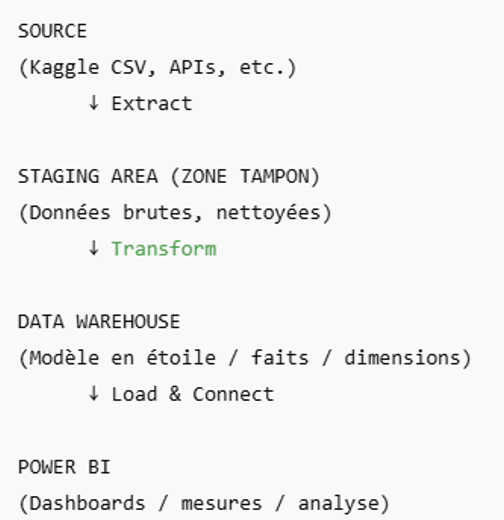

# Electronic Music BI Project

## Overview
This project is a Business Intelligence solution built to analyze electronic music trends using real-world data from Spotify and international music festivals.

The goal of the project is to apply a complete BI workflow:
- Data extraction
- Data transformation
- Dimensional modeling
- Dashboard creation
- Business analysis

## Architecture



## Data Sources

### Spotify (Kaggle)
CSV dataset containing:
- Track metadata
- Artist
- Genre
- BPM (Tempo)
- Popularity
- Duration

### Festivals (Web Scraping)
Scraped via WebScraper.io from:
https://www.festival-alarm.com

Contains:
- Festival name
- Country / City
- Genres
- Visitors
- Ticket prices
- Event dates

## Data Pipeline

```text
RAW DATA (CSV)
      ↓
STAGING AREA
(cleaning, formatting, normalization)
      ↓
DATA WAREHOUSE
(dimensions & fact tables)
      ↓
POWER BI DASHBOARDS
(analytics & KPIs)

Data Modeling

Star Schema structure with:

Fact tables: Tracks, Festivals

Dimension tables: Time, Genre, City, Country, Artist

Schema available in:
data/model/Star_Schema.PNG

Dashboards
Executive Summary

Spotify Analytics

Festivals Analytics

Deliverables

Power BI Dashboard (.pbix)

Executive Summary (PDF)

Architecture slide deck (PPT)

Cleaned datasets

Star schema

Methodology

Tools & Technologies

Power BI

Power Query (ETL)

Data Warehouse modeling

SQL concepts

CSV / Web scraping

GitHub portfolio

Author

Nicolas Englebert
Business Intelligence & Data Analytics student
LinkedIn: https://www.linkedin.com/in/nicolas-englebert-2original/


